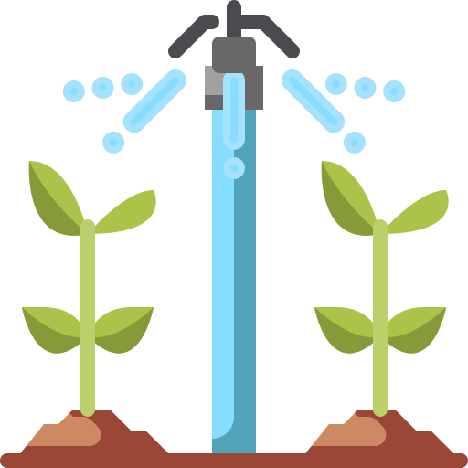
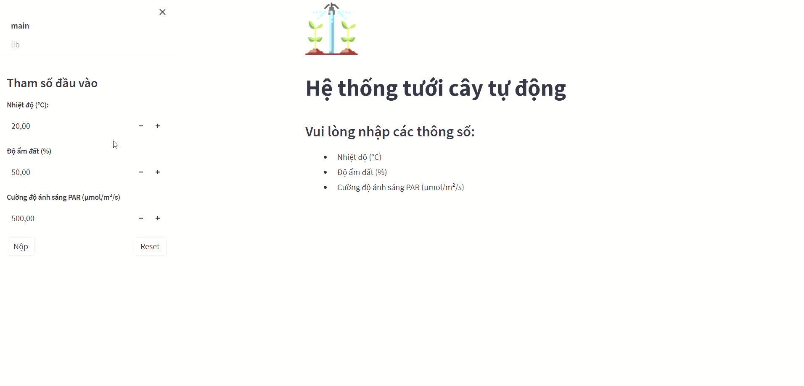

<a name="readme-top"></a>
<!-- TABLE OF CONTENTS -->
<details>
  <summary>Table of Contents</summary>
  <ol>
    <li>
      <a href="#about-the-project">About The Project</a>
      <ul>
        <li><a href="#built-with">Built With</a></li>
      </ul>
    </li>
    <li>
      <a href="#getting-started">Getting Started</a>
      <ul>
        <li><a href="#prerequisites">Prerequisites</a></li>
        <li><a href="#installation">Installation</a></li>
      </ul>
    </li>
    <li><a href="#key-features">Key Features</a></li>
    <li><a href="#usage">Usage</a></li>
    <li><a href="#contact">Contact</a></li>
  </ol>
</details>

<p align="center">
    
</p>

# About The Project
A simple <i>knowledge based system</i> using Fuzzy Logic to calculate the flow rate for watering system, based on current temperature, soil moisture and light intensity.

> :warning: **Warning**: This project is for educational purposes only and doesn't help anything in real life.

## Built With
* [![Python][Python-shield]][Python-url]
* [![Streamlit][Streamlit-shield]][Streamlit-url]
* [![NumPy][NumPy-shield]][NumPy-url]
* [![Pandas][Pandas-shield]][Pandas-url]
* [![[Matplotlib]][Matplotlib-shield]][Matplotlib-url]
* [![Markdown][Markdown-shield]][Markdown-url]
* [![HTML5][HTML5-shield]][HTML5-url]
* [![CSS3][CSS3-shield]][CSS3-url]

<p align="right">(<a href="#readme-top">back to top</a>)</p>

# Getting Started

## Prerequisites
Before cloning and using this application, you'll need to install these things on your computer:
* [Python 3.11.0](https://www.python.org/downloads/release/python-3110/): Streamlit is a app framework in Python language, so you need to have Python installed to run this application. I used Python 3.11.0, but I think it works fine with some other releases as well.
* [Streamlit](https://streamlit.io/): a free and open-source framework to rapidly build and share beautiful machine learning and data science web apps.
* [Visual Studio Code](https://code.visualstudio.com/download): You can choose any IDE or Text Editor that you want. To build a simple application like this, I recommend <b>Visual Studio Code</b>.

## Installation
You can install this application by cloning this repository into your current working directory:
```sh
git clone https://github.com/theEmperorofDaiViet/watering-system.git
```
After cloning the repository, you can open the project by Visual Studio Code.

To install all dependencies needed for this project, open a terminal and type:
```sh
pip install -r requirements.txt
```

To run the application, open a terminal and type:
```sh
streamlit run eat_and_fit.py
```
As usual, the app should automatically open in a new tab in your browser. It runs on port 8501 by default.

<p align="right">(<a href="#readme-top">back to top</a>)</p>

# Key Features
* Get and validate input
* Process input by Fuzzy Logic to calculate suitable flow rate, which consists of 3 steps:
    * Fuzzification
    * Fuzzy inference
    * Defuzzification
* Display all calculations of these steps and visualize them by plots.
* A subpage named "***lib***" provides the same features, but by the [*skfuzzy*](https://pythonhosted.org/scikit-fuzzy/) library, for comparison.

<p align="right">(<a href="#readme-top">back to top</a>)</p>

# Usage
<i>This is a short video, which converted to gif, to illustrate the features of the application in a nutshell:</i>

<p align="center">
    
</p>

- The home page includes a sidebar to navigate through other pages and enter input. The default input is 20°C in temperature, 50% in soil moisture, and 500 µmol/m²/s in light intensity (PAR).
- I change the temperature to 27°C, the soil moisture to 48% and the light intensity to 723 µmol/m²/s, then click <kbd>Nộp</kbd> to submit.
- The calculations, the plots and the final result are displayed.
- Finally, I navigate to the <b><i>lib</i></b> page to get the result calculated by the [*skfuzzy*](https://pythonhosted.org/scikit-fuzzy/) library.

<p align="right">(<a href="#readme-top">back to top</a>)</p>

# Contact
You can contact me via:
* [![GitHub][GitHub-shield]][GitHub-url]
* [![LinkedIn][LinkedIn-shield]][LinkedIn-url]
* ![Gmail][Gmail-shield]:&nbsp;<i>Khiet.To.05012001@gmail.com</i>
* [![Facebook][Facebook-shield]][Facebook-url]
* [![Twitter][Twitter-shield]][Twitter-url]

<br/>
<p align="right">(<a href="#readme-top">back to top</a>)</p>

<!-- MARKDOWN LINKS & IMAGES -->
<!-- Tech stack -->
[Python-shield]: https://img.shields.io/badge/python-3670A0?style=for-the-badge&logo=python&logoColor=ffdd54
[Python-url]: https://www.python.org/
[Streamlit-shield]: https://img.shields.io/badge/Streamlit-FF4B4B?style=for-the-badge&logo=Streamlit&logoColor=white
[Streamlit-url]: https://streamlit.io/
[NumPy-shield]: https://img.shields.io/badge/numpy-%23013243.svg?style=for-the-badge&logo=numpy&logoColor=white
[NumPy-url]: https://numpy.org/
[Pandas-shield]: https://img.shields.io/badge/pandas-%23150458.svg?style=for-the-badge&logo=pandas&logoColor=white
[Pandas-url]: https://pandas.pydata.org
[Matplotlib-shield]: https://img.shields.io/badge/Matplotlib-%23ffffff.svg?style=for-the-badge&logo=Matplotlib&logoColor=black
[Matplotlib-url]: https://matplotlib.org/
[Markdown-shield]: https://img.shields.io/badge/Markdown-000000?style=for-the-badge&logo=markdown&logoColor=white
[Markdown-url]: https://www.markdownguide.org/
[HTML5-shield]: https://img.shields.io/badge/html5-%23E34F26.svg?style=for-the-badge&logo=html5&logoColor=white
[HTML5-url]: https://www.w3.org/html/
[CSS3-shield]: https://img.shields.io/badge/css3-%231572B6.svg?style=for-the-badge&logo=css3&logoColor=white
[CSS3-url]: https://www.w3.org/Style/CSS/
[SQLite-shield]: https://img.shields.io/badge/SQLite-07405E?style=for-the-badge&logo=sqlite&logoColor=white
[SQLite-url]: https://www.sqlite.org/index.html

<!-- Contact -->
[GitHub-shield]: https://img.shields.io/badge/github-%23121011.svg?style=for-the-badge&logo=github&logoColor=white
[GitHub-url]: https://github.com/theEmperorofDaiViet
[LinkedIn-shield]: https://img.shields.io/badge/linkedin-%230077B5.svg?style=for-the-badge&logo=linkedin&logoColor=white
[LinkedIn-url]: https://www.linkedin.com/in/khiet-to/
[Gmail-shield]: https://img.shields.io/badge/Gmail-D14836?style=for-the-badge&logo=gmail&logoColor=white
[Facebook-shield]: https://img.shields.io/badge/Facebook-%231877F2.svg?style=for-the-badge&logo=Facebook&logoColor=white
[Facebook-url]: https://www.facebook.com/Khiet.To.Official/
[Twitter-shield]: https://img.shields.io/badge/Twitter-%231DA1F2.svg?style=for-the-badge&logo=Twitter&logoColor=white
[Twitter-url]: https://twitter.com/KhietTo